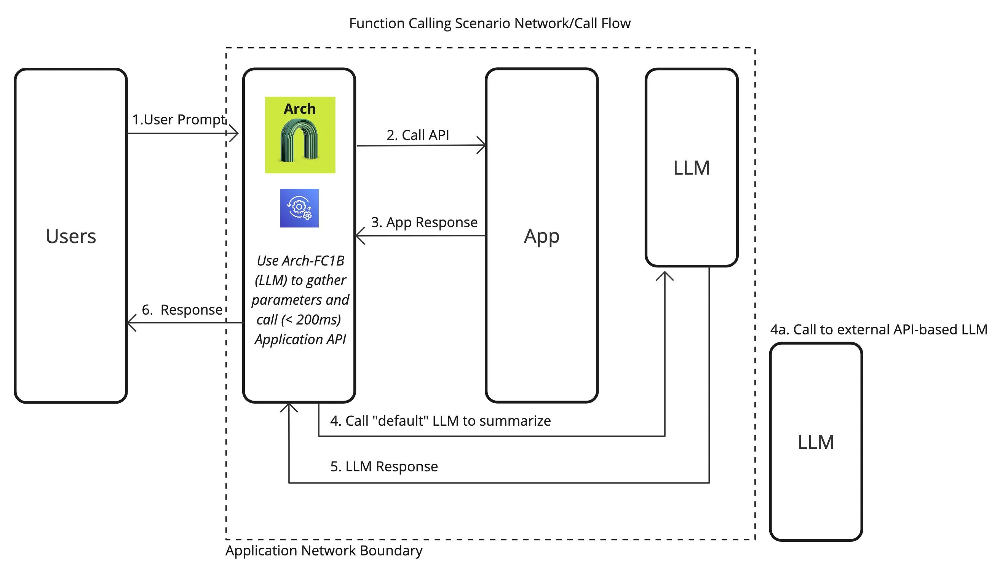
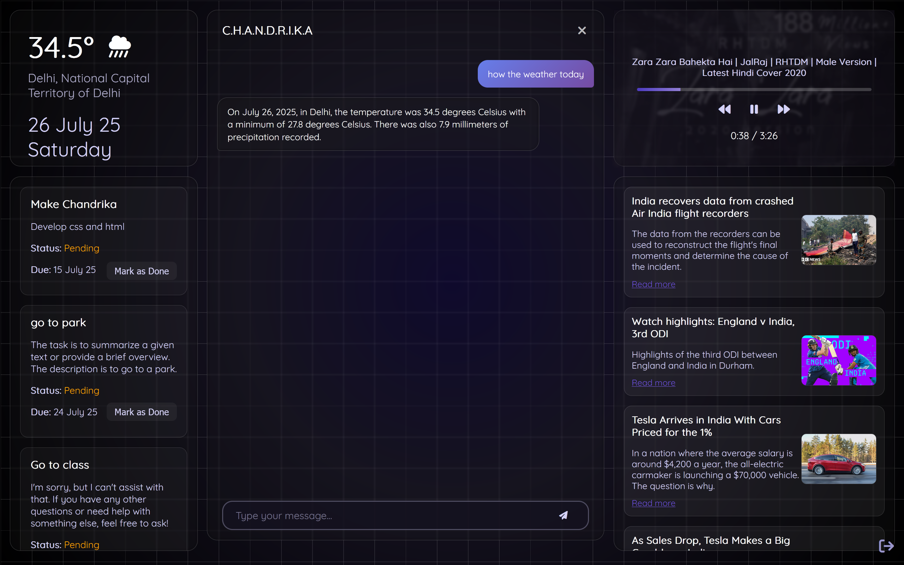
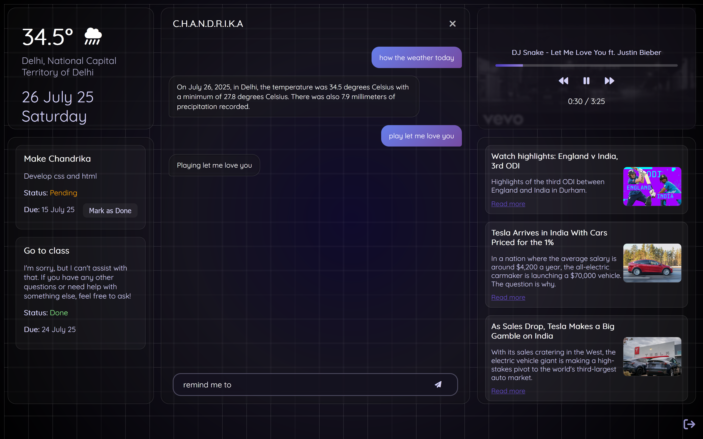
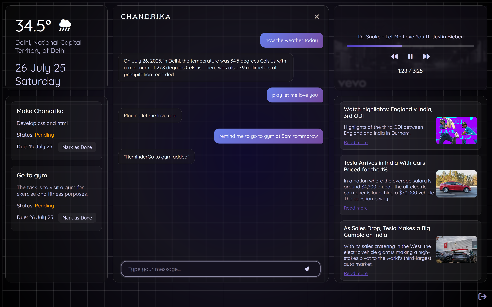
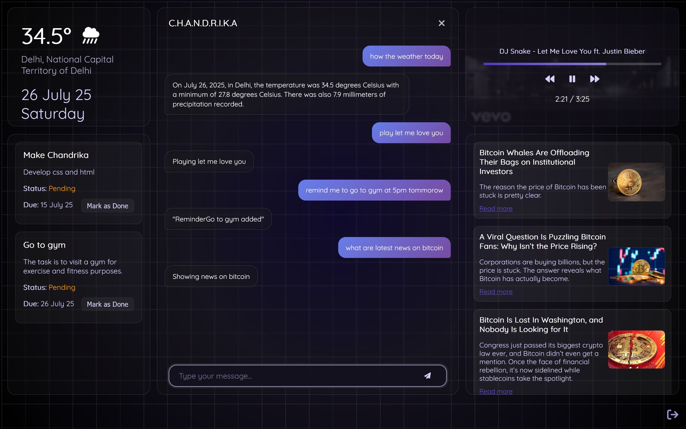

# 🔧 AI-Powered Personal Assistant

An interactive, voice-controlled personal assistant built with a lightweight frontend and a Python-based backend. It leverages cutting-edge LLM technologies and tool-calling capabilities for real-time tasks like Wikipedia summarization, image fetching, task management, and more.
---

## 📸 Image Examples

Below are examples of visual responses generated by the assistant:

| Login Page |
|------------------------------|
|  |

| Weather UI |
|------------------------------|
|  |

| Song Player |
|------------------------------|
|  |

| To-Do Manager |
|------------------------------|
|  |

| News Feed |
|------------------------------|
|  |

## 🚀 Features

- 🌐 **Real-Time Wikipedia Summaries**  
  Retrieves and summarizes Wikipedia content dynamically using FastAPI endpoints.

- 🖼️ **Visual Context with Images**  
  Automatically fetches and displays relevant images alongside answers.

- 🎙️ **Voice-Controlled Interface**  
  Enables speech-to-text input directly in the browser for hands-free usage.

- 🎵 **Integrated Music & Task Assistant**  
  Built-in music controls and Google Tasks API integration for reminders and task management.

- 🌤️ **Live Weather and News**  
  Displays up-to-date weather conditions and trending headlines.

- 🔍 **Improved Search Accuracy**  
  Uses Google Custom Search API to access Wikipedia data with 70% higher factual accuracy.

- ⚙️ **FastAPI Backend + Vanilla JS Frontend**  
  Responsive UI powered by HTML/CSS/JS and a scalable Python backend with FastAPI.

- 🧠 **Optimized LLM Performance**  
  8-bit quantized Microsoft Phi-4 model reduces GPU usage by 50% while retaining 95% response accuracy via custom logic templates.

- 🧩 **Context-Aware Tool-Calling**  
  Dynamically routes queries to appropriate tools (e.g., wiki, weather, tasks) and handles missing-info prompts intelligently.

- 🧱 **Scalable Architecture**  
  Backend built with Supabase + FastAPI enables 15% faster response time under load.

---

## 🛠️ Tech Stack

- **Frontend:** HTML, CSS, JavaScript (Vanilla)
- **Backend:** FastAPI (Python)
- **LLM:** Microsoft Phi-4 (8-bit quantized)
- **Database:** Supabase
- **APIs:** Google Tasks API, Google Custom Search API, OpenWeather API

---
